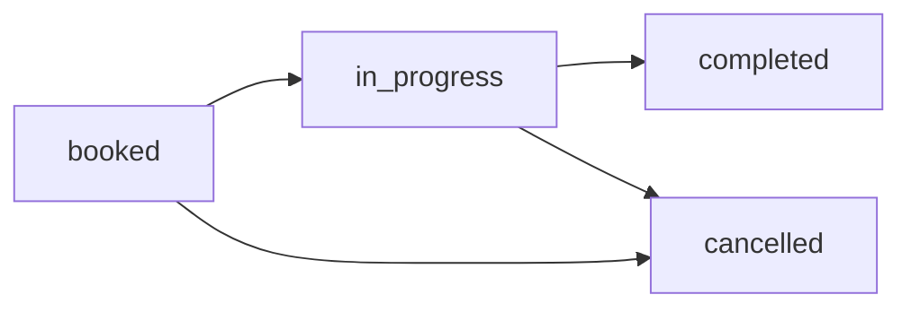

## Overview

Update an existing appointment's details, status, or schedule.

## Endpoint

```
PATCH /api/appointments/{id}
```

## Path Parameters

<ParamField path="id" type="string" required>
  The unique identifier of the appointment to update
</ParamField>

## Request Body

All fields are optional. Include only the fields you want to update.

<ParamField body="schedule_state" type="string">
  Update appointment state: `booked`, `cancelled`, `completed`, `in_progress`
</ParamField>

<ParamField body="starting_time" type="string">
  New start time (ISO 8601 format)
</ParamField>

<ParamField body="finishing_time" type="string">
  New end time (ISO 8601 format)
</ParamField>

<ParamField body="selected_date" type="string">
  New date (ISO 8601 format)
</ParamField>

<ParamField body="reprogram_reason" type="string">
  Reason for rescheduling
</ParamField>

<ParamField body="cancelled_fixer" type="boolean">
  Set to true if fixer is cancelling
</ParamField>

<ParamField body="appointment_description" type="string">
  Updated description
</ParamField>

<ParamField body="display_name_location" type="string">
  Updated location
</ParamField>

<ParamField body="lat" type="string">
  Updated latitude
</ParamField>

<ParamField body="lon" type="string">
  Updated longitude
</ParamField>

## Update Appointment Status

### Mark as Completed

<CodeGroup>

```bash cURL
curl -X PATCH https://api.servineo.com/api/appointments/appt123 \
  -H "Authorization: Bearer YOUR_ACCESS_TOKEN" \
  -H "Content-Type: application/json" \
  -d '{
    "schedule_state": "completed"
  }'
```

```typescript TypeScript
const updateAppointmentStatus = async (
  appointmentId: string,
  status: 'booked' | 'cancelled' | 'completed' | 'in_progress'
) => {
  const response = await fetch(
    `https://api.servineo.com/api/appointments/${appointmentId}`,
    {
      method: 'PATCH',
      headers: {
        'Authorization': `Bearer ${token}`,
        'Content-Type': 'application/json'
      },
      body: JSON.stringify({ schedule_state: status })
    }
  );
  
  return await response.json();
};

// Mark as completed
await updateAppointmentStatus('appt123', 'completed');
```

</CodeGroup>

### Response

```json
{
  "_id": "appt123",
  "schedule_state": "completed",
  "updatedAt": {
    "$date": "2024-03-15T12:30:00.000Z"
  }
}
```

---

## Cancel Appointment

### Cancel by Fixer

<CodeGroup>

```bash cURL
curl -X PATCH https://api.servineo.com/api/appointments/appt123 \
  -H "Authorization: Bearer YOUR_ACCESS_TOKEN" \
  -H "Content-Type: application/json" \
  -d '{
    "schedule_state": "cancelled",
    "cancelled_fixer": true,
    "reprogram_reason": "Emergencia familiar"
  }'
```

```typescript TypeScript
const cancelAppointment = async (
  appointmentId: string,
  reason: string,
  cancelledByFixer: boolean = false
) => {
  const response = await fetch(
    `https://api.servineo.com/api/appointments/${appointmentId}`,
    {
      method: 'PATCH',
      headers: {
        'Authorization': `Bearer ${token}`,
        'Content-Type': 'application/json'
      },
      body: JSON.stringify({
        schedule_state: 'cancelled',
        cancelled_fixer: cancelledByFixer,
        reprogram_reason: reason
      })
    }
  );
  
  return await response.json();
};

// Cancel by fixer
await cancelAppointment('appt123', 'Emergencia familiar', true);

// Cancel by requester
await cancelAppointment('appt123', 'Ya no necesito el servicio', false);
```

</CodeGroup>

### Response

```json
{
  "_id": "appt123",
  "schedule_state": "cancelled",
  "cancelled_fixer": true,
  "reprogram_reason": "Emergencia familiar",
  "updatedAt": {
    "$date": "2024-03-14T16:00:00.000Z"
  }
}
```

---

## Reschedule Appointment

Update the appointment date and time.

<CodeGroup>

```bash cURL
curl -X PATCH https://api.servineo.com/api/appointments/appt123 \
  -H "Authorization: Bearer YOUR_ACCESS_TOKEN" \
  -H "Content-Type: application/json" \
  -d '{
    "selected_date": "2024-03-16T00:00:00.000Z",
    "starting_time": "2024-03-16T10:00:00.000Z",
    "finishing_time": "2024-03-16T13:00:00.000Z",
    "reprogram_reason": "Cambio de horario solicitado por el cliente"
  }'
```

```typescript TypeScript
interface ReschedulePayload {
  selected_date: string;
  starting_time: string;
  finishing_time: string;
  reprogram_reason: string;
}

const rescheduleAppointment = async (
  appointmentId: string,
  newSchedule: ReschedulePayload
) => {
  const response = await fetch(
    `https://api.servineo.com/api/appointments/${appointmentId}`,
    {
      method: 'PATCH',
      headers: {
        'Authorization': `Bearer ${token}`,
        'Content-Type': 'application/json'
      },
      body: JSON.stringify(newSchedule)
    }
  );
  
  return await response.json();
};

await rescheduleAppointment('appt123', {
  selected_date: '2024-03-16T00:00:00.000Z',
  starting_time: '2024-03-16T10:00:00.000Z',
  finishing_time: '2024-03-16T13:00:00.000Z',
  reprogram_reason: 'Cambio de horario solicitado por el cliente'
});
```

</CodeGroup>

### Response

```json
{
  "_id": "appt123",
  "selected_date": {
    "$date": "2024-03-16T00:00:00.000Z"
  },
  "starting_time": {
    "$date": "2024-03-16T10:00:00.000Z"
  },
  "finishing_time": {
    "$date": "2024-03-16T13:00:00.000Z"
  },
  "reprogram_reason": "Cambio de horario solicitado por el cliente",
  "updatedAt": {
    "$date": "2024-03-14T16:15:00.000Z"
  }
}
```

---

## Update Location

Update the appointment location.

<CodeGroup>

```bash cURL
curl -X PATCH https://api.servineo.com/api/appointments/appt123 \
  -H "Authorization: Bearer YOUR_ACCESS_TOKEN" \
  -H "Content-Type: application/json" \
  -d '{
    "display_name_location": "Nueva dirección: Av. España 789, Asunción",
    "lat": "-25.2800",
    "lon": "-57.5900"
  }'
```

```typescript TypeScript
const updateAppointmentLocation = async (
  appointmentId: string,
  location: {
    display_name: string;
    lat: string;
    lon: string;
  }
) => {
  const response = await fetch(
    `https://api.servineo.com/api/appointments/${appointmentId}`,
    {
      method: 'PATCH',
      headers: {
        'Authorization': `Bearer ${token}`,
        'Content-Type': 'application/json'
      },
      body: JSON.stringify({
        display_name_location: location.display_name,
        lat: location.lat,
        lon: location.lon
      })
    }
  );
  
  return await response.json();
};
```

</CodeGroup>

---

## Start Appointment

Mark appointment as in progress when the fixer arrives.

<CodeGroup>

```bash cURL
curl -X PATCH https://api.servineo.com/api/appointments/appt123 \
  -H "Authorization: Bearer YOUR_ACCESS_TOKEN" \
  -H "Content-Type: application/json" \
  -d '{
    "schedule_state": "in_progress"
  }'
```

```typescript TypeScript
await updateAppointmentStatus('appt123', 'in_progress');
```

</CodeGroup>

## Appointment State Transitions



### Valid State Transitions

| From | To | Description |
|------|----|--------------|
| `booked` | `in_progress` | Fixer has arrived and started work |
| `booked` | `cancelled` | Appointment cancelled before start |
| `in_progress` | `completed` | Work finished successfully |
| `in_progress` | `cancelled` | Work cancelled mid-way (rare) |

<Warning>
  Once an appointment is marked as `completed`, it typically cannot be changed to another state.
</Warning>

## Validation Rules

<AccordionGroup>
  <Accordion title="Rescheduling">
    - New start time must be in the future
    - End time must be after start time
    - Check fixer availability at new time slot
    - `reprogram_reason` is required when rescheduling
  </Accordion>
  
  <Accordion title="Cancellation">
    - Can only cancel appointments with state `booked` or `in_progress`
    - `reprogram_reason` should explain the cancellation
    - Set `cancelled_fixer` to identify who cancelled
  </Accordion>
  
  <Accordion title="Status Updates">
    - Cannot mark as completed if still in the future
    - Cannot change status of already completed appointments
    - Only the fixer can mark as `in_progress` or `completed`
  </Accordion>
</AccordionGroup>

## Error Responses

### Appointment Not Found (404)

```json
{
  "success": false,
  "error": "Appointment not found"
}
```

### Invalid State Transition (400)

```json
{
  "success": false,
  "error": "Cannot change state from completed to in_progress"
}
```

### Validation Error (400)

```json
{
  "success": false,
  "error": "Validation failed",
  "errors": {
    "starting_time": ["Start time must be in the future"],
    "finishing_time": ["End time must be after start time"]
  }
}
```

### Unauthorized (401)

```json
{
  "success": false,
  "error": "Unauthorized - You can only update your own appointments"
}
```

## Related Endpoints

- [Get Appointments](/api/appointments/get-appointments)
- [Create Appointment](/api/appointments/create-appointment)
